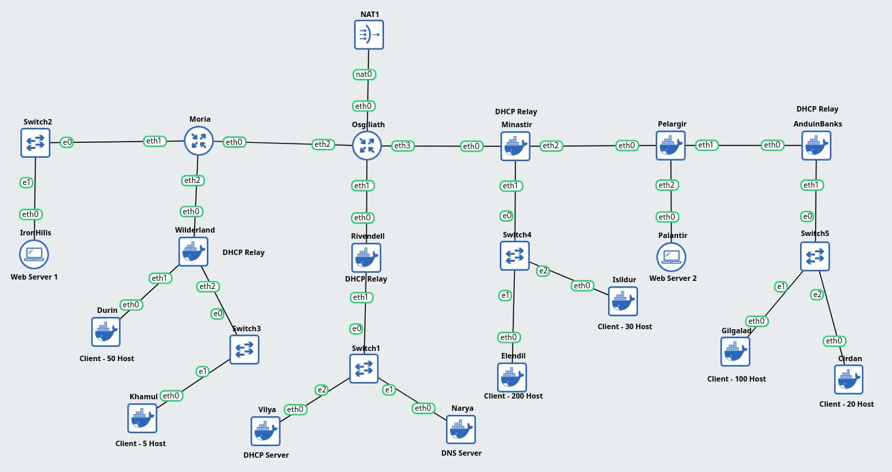
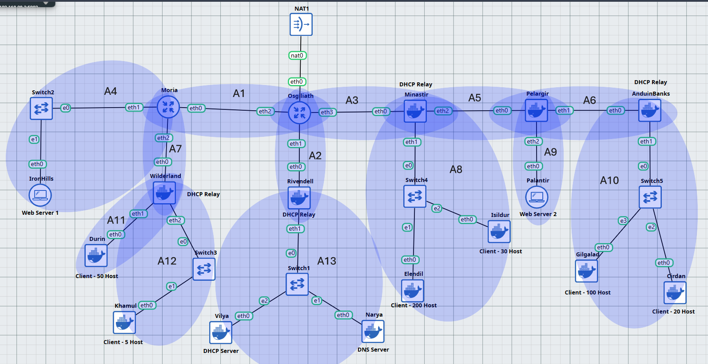
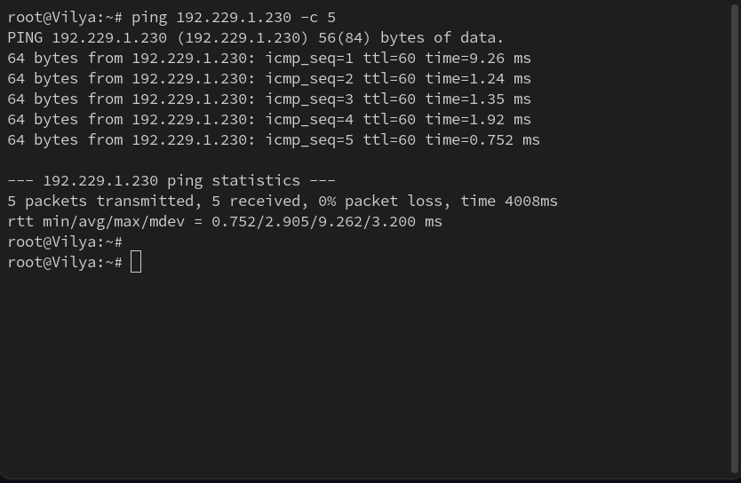

# Laporan Jarkom Modul 5 Kelompok K-36

## Anggota

| Nama							| NRP			|
|-------------------------------|---------------|
| Ahmad Wildan Fawwaz			| 5027241001	|
| Muhammad Rakha Hananditya R.	| 5027241015	|

## Asisten Penguji
| Nama							| Kode Asisten	|
|-------------------------------|---------------|
| Nayla Raissa Azzahra			| P5			|

## Pendahuluan

بِسْمِ اللَّهِ الرَّحْمَنِ الرَّحِيْمِ

<p align="justify">
&emsp; Segala puji syukur kita panjatkan atas kehadirat Allah Subḥānahu wa Ta‘ālā, karena berkat atas rahmat, karunia, dan nikmat-Nya praktikum modul 5 untuk mata kuliah Komunikasi Data dan Jaringan Komputer dapat diselesaikan dengan baik. Tidak lupa shalawat serta salam semoga senantiasa tercurah kepada junjungan kita Nabi Muhammad Shallallāhu ‘alaihi wa Sallam, suri teladan terbaik bagi umat manusia, beserta keluarga, sahabat, dan para pengikutnya hingga akhir zaman.
</p>

<p align="justify">
&emsp; Laporan ini disusun sebagai suatu bentuk pertanggungjawaban akademik atas kegiatan praktikum yang telah dilaksanakan. Selain itu, laporan ini berfungsi sebagai dokumentasi resmi tertulis dari seluruh rangkaian kegiatan yang telah dilakukan, sehingga dapat menjadi acuan dalam evaluasi maupun penilaian praktikum.
</p>

Rasulullah Shallallāhu ‘alaihi wa Sallam pernah bersabda:

إِذَا مَاتَ ابْنُ آدَمَ انْقَطَعَ عَمَلُهُ إِلَّا مِنْ ثَلَاثٍ: صَدَقَةٍ جَارِيَةٍ، أَوْ عِلْمٍ يُنْتَفَعُ بِهِ، أَوْ وَلَدٍ صَالِحٍ يَدْعُو لَهُ


<em>Artinya</em>:
<p align="justify">
"Apabila anak Adam meninggal dunia, maka terputuslah amalnya kecuali tiga perkara: sedekah jariyah, ilmu yang bermanfaat, atau anak shalih yang mendoakannya." 
<br>
(HR. Muslim, no. 1631)
</p>
  
وَمَنْ سَلَكَ طَرِيقًا يَلْتَمِسُ فِيهِ عِلْمًا سَهَّلَ اللَّهُ لَهُ بِهِ طَرِيقًا إِلَى الْجَنَّةِ

<em>Artinya</em>:
<p align="justify">
"Barang siapa yang menempuh jalan untuk mencari ilmu, maka Allah akan mudahkan baginya jalan menuju surga." 
 <br>
(HR. Muslim, no. 2699)
</p>
  
<p align="justify">
&emsp; Maka dari itu, semoga apa yang tertulis pada laporan ini dapat menjadi ilmu yang bermanfaat, serta menjadi keberkahan dan amal yang diterima di sisi Allah Subḥānahu wa Ta‘ālā. Semoga bagi yang membaca ini, Allah memudahkan semua langkahnya dalam menuntut ilmu, mengamalkannya, serta menjaganya agar tidak sekadar menjadi hafalan, namun juga menjadi bekal yang membawanya ke surga.
</p>

Āmīn yā Rabbal ‘ālamīn.

## Daftar Isi

- [Anggota](#anggota)
- [Pendahuluan](#pendahuluan)
- [Daftar Isi](#daftar-isi)
- [Walkthrough](#walkthrough)
    - [Misi 1: Memetakan Medan Perang](#-misi-1-memetakan-medan-perang)
        - [Soal 1](#a-soal-1)
        - [Soal 2](#b-soal-2)
        - [Soal 3](#c-soal-3)
        - [Soal 4](#d-soal-4)
    - [Misi 2: Menemukan Jejak Kegelapan (Security Rules)](#-misi-2-menemukan-jejak-kegelapan-security-rules)
        - [Soal 1](#a-soal-1)
        - [Soal 2](#b-soal-2)
        - [Soal 3](#c-soal-3)
        - [Soal 4](#d-soal-4)
        - [Soal 5](#e-soal-5)
        - [Soal 6](#f-soal-6)
        - [Soal 7](#g-soal-7)
        - [Soal 8](#h-soal-8)
    - [Misi 3: Isolasi Sang Nazgûl [|||||]](#-misi-3-isolasi-sang-nazgûl-)
        - [Soal 1](#a-soal-1)

## Walkthrough

### • Misi 1: Memetakan Medan Perang

#### a. Soal 1

<blockquote>
	<ol start="1">
		<li>
			<p align="justify">
				<b>Identifikasi Perangkat:</b>
				<ul>
					<li><b>Narya:</b> Berfungsi sebagai DNS Server.</li>
					<li><b>Vilya:</b> Berfungsi sebagai DHCP Server.</li>
					<li><b>Web Servers:</b> <b>Palantir</b>  dan <b>IronHills</b>.</li>
					<li><b>Client (Pasukan):</b></li>
					<ul>
						<li><b>Khamul:</b> 5 host (Target/Burnice).</li>
						<li><b>Cirdan:</b> 20 host (Lycaon).</li>
						<li><b>Isildur:</b> 30 host (Policeboo).</li>
						<li><b>Durin:</b> 50 host (Caesar).</li>
						<li><b>Gilgalad:</b> 100 host (Ellen).</li>
						<li><b>Elendil:</b> 200 host (Jane).</li>
					</ul>
				</ul>
			</p>
		</li>
	</ol>
</blockquote>

<p align="justify">
&emsp; Langkah pertama adalah mengidentifikasi perangkat dan melakukan pemetaan topologi jaringannya terlebih dahulu dan menghubungkan link antar node sesuai dengan ketentuan yang ada pada soal di GNS3.
</p>

<p align="center">
	  
</p>

#### b. Soal 2

<blockquote>
	<ol start="2">
		<li>
			<p align="justify">
				Setelah membagi alamat IP menggunakan VLSM (Prefix IP sesuai kelompok), gambarkan <b>pohon subnet</b> yang menunjukkan hierarki pembagian IP di jaringan Aliansi. Lingkari subnet yang akan dilewati.
			</p>
		</li>
	</ol>
</blockquote>

<p align="justify">
&emsp; Langkah selanjutnya adalah melakukan <b>subnetting</b> dengan metode <b>VLSM</b> untuk menentukan <i>range</i> IP dari setiap subnet yang ada pada topologi jaringan.
</p>

Di mana pembagian subnet pada topologinya:

<p align="center">
	  
</p>

<div align="center">
	
| Nama Subnet | Rute                                   	| Jumlah IP | Netmask |
|-------------|-----------------------------------------|-----------|---------|
| A1          | Osgilath > Moria                        | 2         | /30     |
| A2          | Osgilath > Rivendell                    | 2         | /30     |
| A3          | Osgilath > Minastir                     | 2         | /30     |
| A4          | Moria > Switch2 > IronHills             | 2         | /30     |
| A5          | Minastir > Pelargir                     | 2         | /30     |
| A6          | Pelargir > AnduinBanks                  | 2         | /30     |
| A7          | Moria > Wilderland                      | 2         | /30     |
| A8          | Minastir > Switch4 > Isildur, Elendil   | 231       | /24     |
| A9          | Pelargir > Palantir                     | 2         | /30     |
| A10         | AnduinBanks > Switch5 > Gilgalad, Cirdan| 121       | /25     |
| A11         | Wilderland > Durin                      | 51        | /26     |
| A12         | Wilderland > Switch3 > Khamul           | 6         | /29     |
| A13         | Rivendell > Switch1 > Vilya, Narya      | 3         | /29     |
|			  | **Total**                               | **428**   | **/23** |

</div>

Di mana pembagian _range_ IP pada tabel VLSM, diurutkan berdasarkan **jumlah IP** setiap subnet:

<div align="center">
	
| Subnet | Network ID      | Netmask			| Broadcast        | Range IP                          |
|--------|------------------|-------------------|------------------|-----------------------------------|
| A8     | 192.229.0.0      | 255.255.255.0     | 192.229.0.255    | 192.229.0.1 - 192.229.0.254       |
| A10    | 192.229.1.0      | 255.255.255.128   | 192.229.1.127    | 192.229.1.1 - 192.229.1.126       |
| A11    | 192.229.1.128    | 255.255.255.192   | 192.229.1.191    | 192.229.1.129 - 192.229.1.190     |
| A12    | 192.229.1.192    | 255.255.255.248   | 192.229.1.199    | 192.229.1.193 - 192.229.1.198     |
| A13    | 192.229.1.200    | 255.255.255.248   | 192.229.1.207    | 192.229.1.201 - 192.229.1.206     |
| A1     | 192.229.1.208    | 255.255.255.252   | 192.229.1.211    | 192.229.1.209 - 192.229.1.210     |
| A2     | 192.229.1.212    | 255.255.255.252   | 192.229.1.215    | 192.229.1.213 - 192.229.1.214     |
| A3     | 192.229.1.216    | 255.255.255.252   | 192.229.1.219    | 192.229.1.217 - 192.229.1.218     |
| A4     | 192.229.1.220    | 255.255.255.252   | 192.229.1.223    | 192.229.1.221 - 192.229.1.222     |
| A5     | 192.229.1.224    | 255.255.255.252   | 192.229.1.227    | 192.229.1.225 - 192.229.1.226     |
| A6     | 192.229.1.228    | 255.255.255.252   | 192.229.1.231    | 192.229.1.229 - 192.229.1.230     |
| A7     | 192.229.1.232    | 255.255.255.252   | 192.229.1.235    | 192.229.1.233 - 192.229.1.234     |
| A9     | 192.229.1.236    | 255.255.255.252   | 192.229.1.239    | 192.229.1.237 - 192.229.1.238     |
  
</div>

#### c. Soal 3

<blockquote>
	<ol start="3">
		<li>
			<p align="justify">
				Buatlah konfigurasi rute untuk menghubungkan semua subnet dengan benar. Pastikan perangkat dapat saling terhubung.
			</p>
		</li>
	</ol>
</blockquote>

<p align="justify">
&emsp; Langkah selanjutnya, untuk memastikan bahwa setiap node dapat berkomunikasi dengan satu sama lain, maka kita dapat beralih ke menu <code>Configure > Edit Network Configuration</code> untuk setiap node yang ada untuk melakukan <b><i>assign</i> IP</b> dan <b><i>routing</i></b>.
</p>

Di mana ketentuan untuk setiap nodenya:

1. **Osgilath**

```sh
auto eth0
iface eth0 inet static
   address 192.168.122.10
   netmask 255.255.255.0
   gateway 192.168.122.1

auto eth1
iface eth1 inet static
   address 192.229.1.213
   netmask 255.255.255.252

auto eth2
iface eth2 inet static
   address 192.229.1.209
   netmask 255.255.255.252

auto eth3
iface eth3 inet static
   address 192.229.1.217
   netmask 255.255.255.252

up route add -net 192.229.1.220 netmask 255.255.255.252 gw 192.229.1.210
up route add -net 192.229.1.232 netmask 255.255.255.252 gw 192.229.1.210
up route add -net 192.229.1.128 netmask 255.255.255.192 gw 192.229.1.210
up route add -net 192.229.1.192 netmask 255.255.255.248 gw 192.229.1.210
up route add -net 192.229.1.224 netmask 255.255.255.252 gw 192.229.1.218
up route add -net 192.229.0.0 netmask 255.255.255.0 gw 192.229.1.218
up route add -net 192.229.1.236 netmask 255.255.255.252 gw 192.229.1.218
up route add -net 192.229.1.228 netmask 255.255.255.252 gw 192.229.1.218
up route add -net 192.229.1.0 netmask 255.255.255.128 gw 192.229.1.218
up route add -net 192.229.1.200 netmask 255.255.255.248 gw 192.229.1.214
up route add default gw 192.168.122.1
```

2. **Moria**

```sh
auto eth0
iface eth0 inet static
   address 192.229.1.210
   netmask 255.255.255.252
   gateway 192.229.1.209

auto eth1
iface eth1 inet static
   address 192.229.1.221
   netmask 255.255.255.252

auto eth2
iface eth2 inet static
   address 192.229.1.233
   netmask 255.255.255.252

up route add -net 192.229.1.128 netmask 255.255.255.192 gw 192.229.1.234
up route add -net 192.229.1.192 netmask 255.255.255.248 gw 192.229.1.234
up route add default gw 192.229.1.209
```

3. **IronHills**

```sh
auto eth0
iface eth0 inet static
   address 192.229.1.222
   netmask 255.255.255.252
   gateway 192.229.1.221
```

4. **Wilderland**

```sh
auto eth0
iface eth0 inet static
   address 192.229.1.234
   netmask 255.255.255.252
   gateway 192.229.1.233

auto eth1
iface eth1 inet static
   address 192.229.1.129
   netmask 255.255.255.192

auto eth2
iface eth2 inet static
   address 192.229.1.193
   netmask 255.255.255.248

up route add default gw 192.229.1.233
```

5. **Durin**

```sh
auto eth0
iface eth0 inet dhcp
```

6. **Khamul**

```sh
auto eth0
iface eth0 inet dhcp
```
7. **Rivendell**

```sh
auto eth0
iface eth0 inet static
   address 192.229.1.214
   netmask 255.255.255.252
   gateway 192.229.1.213

auto eth1
iface eth1 inet static
   address 192.229.1.201
   netmask 255.255.255.248

up route add default gw 192.229.1.213
```

8. **Vilya**

```sh
auto eth0
iface eth0 inet static
   address 192.229.1.202
   netmask 255.255.255.248
   gateway 192.229.1.201
```

9. **Narya**

```sh
auto eth0
iface eth0 inet static
   address 192.229.1.203
   netmask 255.255.255.248
   gateway 192.229.1.201
```

10. **Minastir**

```sh
auto eth0
iface eth0 inet static
   address 192.229.1.218
   netmask 255.255.255.252
   gateway 192.229.1.217

auto eth1
iface eth1 inet static
   address 192.229.0.1
   netmask 255.255.255.0

auto eth2
iface eth2 inet static
   address 192.229.1.225
   netmask 255.255.255.252

up route add -net 192.229.1.236 netmask 255.255.255.252 gw 192.229.1.226
up route add -net 192.229.1.228 netmask 255.255.255.252 gw 192.229.1.226
up route add -net 192.229.1.0 netmask 255.255.255.128 gw 192.229.1.226
up route add default gw 192.229.1.217
```

11. **Elendil**

```sh
auto eth0
iface eth0 inet dhcp
```

12. **Isildur**

```sh
auto eth0
iface eth0 inet dhcp
```

13. **Pelargir**

```sh
auto eth0
iface eth0 inet static
   address 192.229.1.226
   netmask 255.255.255.252
   gateway 192.229.1.225

auto eth1
iface eth1 inet static
   address 192.229.1.229
   netmask 255.255.255.252

auto eth2
iface eth2 inet static
   address 192.229.1.237
   netmask 255.255.255.252

up route add -net 192.229.1.0 netmask 255.255.255.128 gw 192.229.1.230
up route add default gw 192.229.1.225
```

14. **Palantir**

```sh
auto eth0
iface eth0 inet static
   address 192.229.1.238
   netmask 255.255.255.252
   gateway 192.229.1.237
```

15. **AnduinBanks**

```sh
auto eth0
iface eth0 inet static
   address 192.229.1.230
   netmask 255.255.255.252
   gateway 192.229.1.229

auto eth1
iface eth1 inet static
   address 192.229.1.1
   netmask 255.255.255.128

up route add default gw 192.229.1.229
```

16. **Gilgalad**

```sh
auto eth0
iface eth0 inet dhcp
```

17. **Cirdan**

```sh
auto eth0
iface eth0 inet dhcp
```

<p align="justify">
&emsp; Terakhir, kita perlu memastikan bahwasannya semua konfigurasi <i>routing</i> sudah benar dan <i>packet</i> yang dikirimkan dari suatu subnet dapat mencapai destinasinya di subnet yang berbeda. Hal ini dapat dilakukan dengan menggunakan command <code>ping</code>, di mana langkah implementasinya:
</p>

1. `ping` **Palantir** dari **IronHills**:

```sh
ping 192.229.1.238 -c 5
```

<p align="center">
	  
</p>

2. `ping` **AnduinBanks** dari **Vilya**:

```sh
ping 192.229.1.230 -c 5
```

<p align="center">
	  
</p>

#### d. Soal 4

<blockquote>
	<ol start="4">
		<li>
			<p align="justify">
				<b>Konfigurasi Service → Dikerjakan setelah Misi 2 No. 1:</b>
				<ul>
					<li><b>Vilya</b> sebagai <b>DHCP Server</b> agar perangkat dalam Khamul, Durin, Gilgalad, Elendil, Cirdan, dan Isildur menerima IP otomatis.</li>
					<li><b>AnduinBanks</b>, <b>Rivendell</b>, dan <b>Minastir</b> berfungsi sebagai <b>DHCP Relay</b>.</li>
					<li><b>Narya</b> sebagai <b>DNS Server</b>.</li>
					<li><b>Palantir</b> dan <b>IronHills</b> sebagai <b>Web Server (Apache/Nginx)</b>.</li>
					<li>Buat index.html berisikan : "Welcome to {hostname}".</li>
				</ul>
			</p>
		</li>
	</ol>
</blockquote>

### • Misi 2: Menemukan Jejak Kegelapan (Security Rules)

#### a. Soal 1

<blockquote>
	<ol start="1">
		<li>
			<p align="justify">
				Agar jaringan Aliansi bisa terhubung ke luar (Valinor/Internet), konfigurasi routing menggunakan iptables.
				<ul>
					<li><b>Syarat:</b> Kalian <b>TIDAK DIPERBOLEHKAN</b> menggunakan target MASQUERADE.</li>
				</ul>
			</p>
		</li>
	</ol>
</blockquote>

#### b. Soal 2

<blockquote>
	<ol start="2">
		<li>
			<p align="justify">
				Karena <b>Vilya</b> (DHCP) menyimpan data vital, pastikan <b>tidak ada perangkat lain yang bisa melakukan PING ke Vilya</b>.
				<ul>
					<li>Namun, <b>Vilya</b> tetap leluasa dapat mengakses/<code>ping</code> ke seluruh perangkat lain.</li>
				</ul>
			</p>
		</li>
	</ol>
</blockquote>


#### c. Soal 3

<blockquote>
	<ol start="3">
		<li>
			<p align="justify">
				Agar lokasi pasukan tidak bocor, <b>hanya Vilya yang dapat mengakses Narya (DNS)</b>.
				<ul>
					<li>Gunakan <code>nc</code> (netcat) untuk memastikan akses port DNS (53) ini.</li>
					<li><i>[Hapus aturan ini setelah pengujian agar internet lancar untuk install paket]</i></li>
				</ul>
			</p>
		</li>
	</ol>
</blockquote>


#### d. Soal 4

<blockquote>
	<ol start="4">
		<li>
			<p align="justify">
				Aktivitas mencurigakan terdeteksi di <b>IronHills</b>. Berdasarkan dekrit Raja, IronHills hanya boleh diakses pada <b>Akhir Pekan (Sabtu & Minggu)</b>.
				<ul>
					<li>Akses hanya diizinkan untuk <b>Faksi Kurcaci & Pengkhianat</b> (Durin & Khamul) serta <b>Faksi Manusia</b> (Elendil & Isildur).</li>
					<li>Karena hari ini adalah <b>Rabu</b> (Simulasikan waktu server), mereka harusnya tertolak. Gunakan <code>curl</code> untuk membuktikan blokir waktu ini.</li>
				</ul>
			</p>
		</li>
	</ol>
</blockquote>

#### e. Soal 5

<blockquote>
	<ol start="5">
		<li>
			<p align="justify">
				Sembari menunggu, pasukan berlatih di server <b>Palantir</b>. Akses dibatasi berdasarkan ras:
				<ul>
					<li><b>Faksi Elf</b> (Gilgalad & Cirdan): Boleh akses jam <b>07.00 - 15.00</b>.</li>
					<li><b>Faksi Manusia</b> (Elendil & Isildur): Boleh akses jam <b>17.00 - 23.00</b>.</li>
					<li>Gunakan <code>curl</code> untuk memastikan akses sesuai jam.</li>
				</ul>
			</p>
		</li>
	</ol>
</blockquote>

#### f. Soal 6

<blockquote>
	<ol start="6">
		<li>
			<p align="justify">
				Pasukan Manusia (Elendil) diminta menguji keamanan <b>Palantir</b>. Lakukan simulasi port scan dengan <code>nmap</code> rentang port 1-100.
				<ul>
					<li>Web server harus memblokir scan port yang melebihi <b>15 port</b> dalam waktu <b>20 detik</b>.</li>
					<li>Penyerang yang terblokir tidak dapat melakukan <code>ping</code>, <code>nc</code>, atau <code>curl</code> ke Palantir.</li>
					<li>Catat log iptables dengan prefix "PORT_SCAN_DETECTED".</li>
				</ul>
			</p>
		</li>
	</ol>
</blockquote>

#### g. Soal 7

<blockquote>
	<ol start="7">
		<li>
			<p align="justify">
				Hari Sabtu tiba. Akses ke <b>IronHills</b> dibatasi untuk mencegah overload.
				<ul>
					<li>Akses ke IronHills hanya boleh berasal dari <b>3 koneksi aktif</b> per IP dalam waktu bersamaan.</li>
					<li>Lakukan uji coba beban (stress test) menggunakan <code>curl</code> atau <code>ab</code>.</li>
				</ul>
			</p>
		</li>
</blockquote>

#### h. Soal 8

<blockquote>
	<ol start="8">
		<li>
			<p align="justify">
				Selama uji coba, terdeteksi anomali. Setiap paket yang dikirim <b>Vilya</b> menuju <b>Khamul</b>, ternyata dibelokkan oleh sihir hitam menuju <b>IronHills</b>.
				<ul>
					<li>Gunakan <code>nc</code> untuk memastikan alur pengalihan ini (Redirect trafik dari Client ke Server).</li>
				</ul>
		</li>
</blockquote>

### • Misi 3: Isolasi Sang Nazgûl [|||||]

#### a. Soal 1

<blockquote>
	<ol start="1">
		<li>
			<p align="justify">
				<b>Penjara Barad-dûr:</b> Mengetahui pengkhianatan Khamul, Aliansi mengambil langkah final: <b>Blokir semua lalu lintas masuk dan keluar dari Khamul</b>.
				<ul>
					<li>Gunakan <code>nc</code> dan <code>ping</code> untuk membuktikan Khamul terisolasi total.</li>
					<li><b>Penting:</b> Yang diblokir adalah Khamul (5 Host), <b>BUKAN</b> Durin (50 Host). Jangan sampai salah sasaran.</li>
				</ul>
		</li>
</blockquote>
